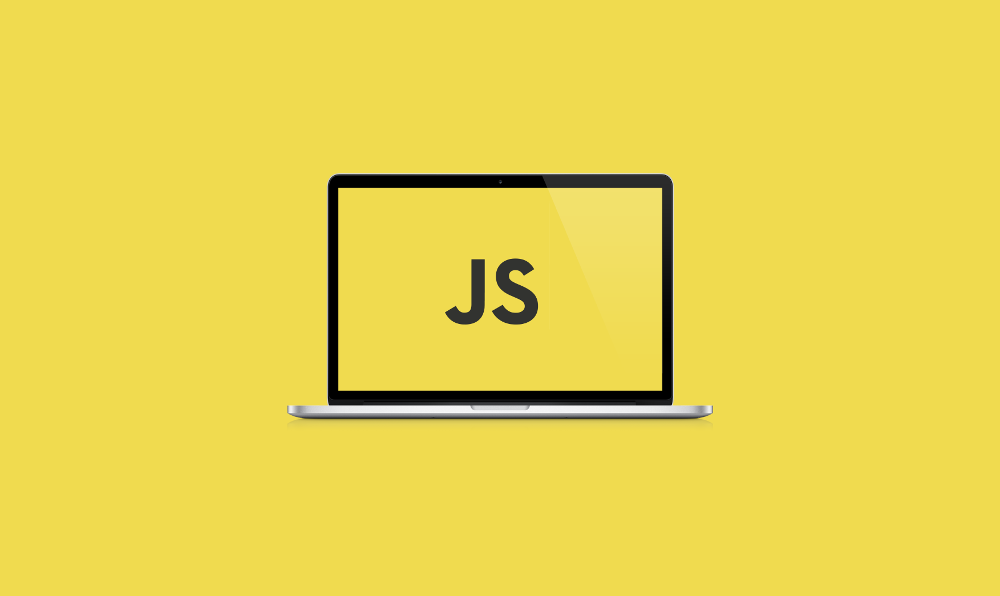

# :beginner: JavaScript Interview Code Challenges :rocket: :rocket:

### The difficulty level will be displayed as follows -
:green_heart: EASY
:yellow_heart: MEDIUM
:heart: DIFFICULT


## 1. Code Output

Find the output of the below code ? 
##### Difficulty - :yellow_heart: 
##### Topics - `Scoping` | `Web Api` | `Event Loop`
##### Companies - `CARS24`


```js
for(var i = 0; i < 4; i++) {
  setTimeout(()=> console.log(i), i*1000)
}
```

<details><summary>Solution</summary>

```js
4
4
4
4
```

**Explain:**

nope.
</details>

---

**[⬆ Back to Top](#javascript-interview-code-challenges)**

## 2. Even or Odd

Create a function that takes an integer as an argument and returns "Even" for even numbers or "Odd" for odd numbers.

##### Difficulty - :green_heart: 
##### Topics - `if-else` | `ternary operator`
##### Companies - None

```js
const even_or_odd = number => {
  // Your solution
};

console.log(even_or_odd(0)); // 'Even'
console.log(even_or_odd(2)); // 'Even'
console.log(even_or_odd(3)); // 'Odd'
console.log(even_or_odd(-3)); // 'Odd'
```

<details><summary>Solution</summary>

```js
const even_or_odd = number => {
  // Let's use a ternary operator
  return number % 2 === 0 ? 'Even' : 'Odd';
};
```
**Explain:**

nope.

</details>

---

**[⬆ Back to Top](#javascript-interview-code-challenges)**

## 3. What is `this`?

Find the output of below code -

##### Difficulty - :heart: 
##### Topics - `this`
##### Companies - `CARS24`

```js
let user = {
  name: "Nishant Singh",
  age: 24,
  childObj:{
        newName:"Coding With Chandel",
        getDetails() {
            console.log(this.newName, " & " ,this.name);
        }
    }
};

user.childObj.getDetails();

```

<details><summary>Solution</summary>

```js
"Coding With Chandel & undefined"
```

**Explain:**

nope.

</details>

---

**[⬆ Back to Top](#javascript-interview-code-challenges)**

## 4. Returning Strings

Write a function that given the input string `name`, returns the greeting statement `Hello, <name> how are you doing today?`

```js
const greet = name => {
  //Your solution
};

console.log(greet('Ryan')); // "Hello, Ryan how are you doing today?"
console.log(greet('Sara')); // "Hello, Sara how are you doing today?"
```

<details><summary>Solution</summary>

```js
const greet = name => {
  // Let's use a template literal
  return `Hello, ${name} how are you doing today?`;
};
```

</details>

---

**[⬆ Back to Top](#javascript-interview-code-challenges)**

## 5. Century From Year

The first century spans from the year 1 up to and including the year 100, The second - from the year 101 up to and including the year 200, etc. Given a year, return the century it is in.

```js
const century = year => {
  // Your solution
};

console.log(century(1705)); // 18
console.log(century(1900)); // 19
console.log(century(1601)); // 17
console.log(century(2000)); // 20
console.log(century(89)); // 1
```

<details><summary>Solution</summary>

```js
const century = year => {
  return Math.ceil(year / 100);
};
```

</details>

---

**[⬆ Back to Top](#javascript-interview-code-challenges)**